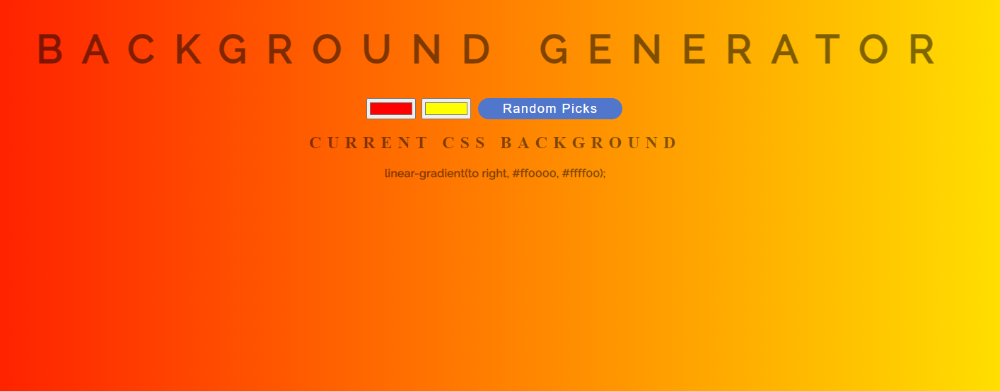

# BACKGROUND COLOUR GENERATOR<!-- omit in toc -->

 

## Version 1.0<!-- omit in toc -->

- **Project Start:** February 26, 2022
- **Project End:** February 27, 2022

 

# CONTENTS
- [CONTENTS](#contents)
  - [Introduction](#introduction)
  - [Screnshots](#screnshots)
    - [DESKTOP](#desktop)
  - [Methodology](#methodology)
  - [Tools I Used](#tools-i-used)
  - [What I learned](#what-i-learned)
  - [Items for further study](#items-for-further-study)
  - [Helpful sites](#helpful-sites)
  - [About me](#about-me)

Introduction
---
This is gradient colour background generator, where the user can choose two different colours to create a gradient bsckground. The CSS code for that combination appears beneath so that the user can use it in their projects. There is also a 'Random Picks' button where the colours will be randomly chosen.

This project is from the "Complete Web Developer in 2022: Zero to Mastery" course on the [Zero-to-Mastery website](https://zerotomastery.io/).

 

Screnshots
---
 

### DESKTOP

 

 

Methodology
---

I followed along with the lesson, really. We were given exercises to complete afterwards, one of which was to add a 'Random' Button to generate random colours. I vagely remember doing a smiliar randomizer many months ago, so I went back to what I did there and incorporated that into my code here.

After completing that, I made some slight adjustments to the colour picker sizes and the design of the button.

 

Tools I Used
---
* HTML5
* CSS3
* Javascript

 

What I learned
---
It was fun trying to remember how to do the Random Picker (all my previous efforts to get it to work fell short until I remember the previous exercise I did). 

 

Items for further study
---
Well, I need to use `Math.Random()` more, certainly. Also, would like to play around more with gradients in general.

I also want to add a shimmer gradient bakcground to the `Random Picks` button upon hover. 

 

Helpful sites
---
- **Build 15 JavaScript Projects - Vanilla JavaScript Course: Color Flipper**: [https://youtu.be/3PHXvlpOkf4?t=422](https://youtu.be/3PHXvlpOkf4?t=422) -- An awesome tutorial taught by John Smilga. There's 15 tutaorials here; the one I'm linking to here is the first one, which is the Colour Filpper

 

About me
---
Thanks for checking out this project! 😃 You can find my profiles at these sites:
- [Twitter: @IT_Sonji](https://twitter.com/sonji_it)
- [Frontend Mentor - @infinity-Mineeva](https://www.frontendmentor.io/profile/Infinity-Mineeva)